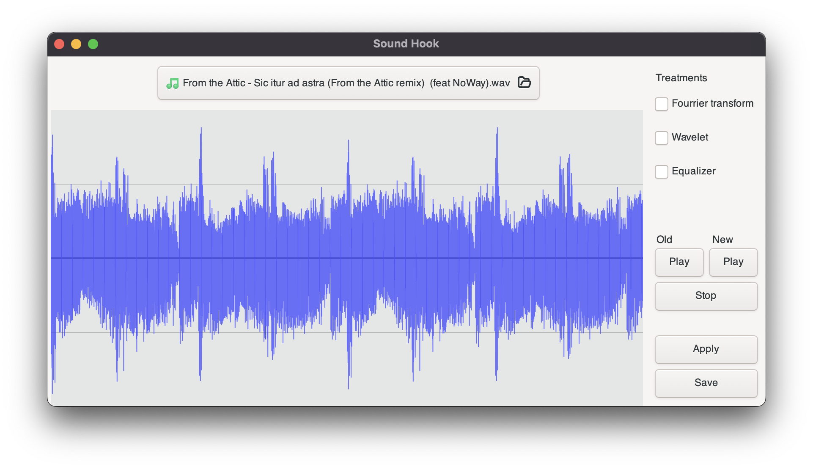
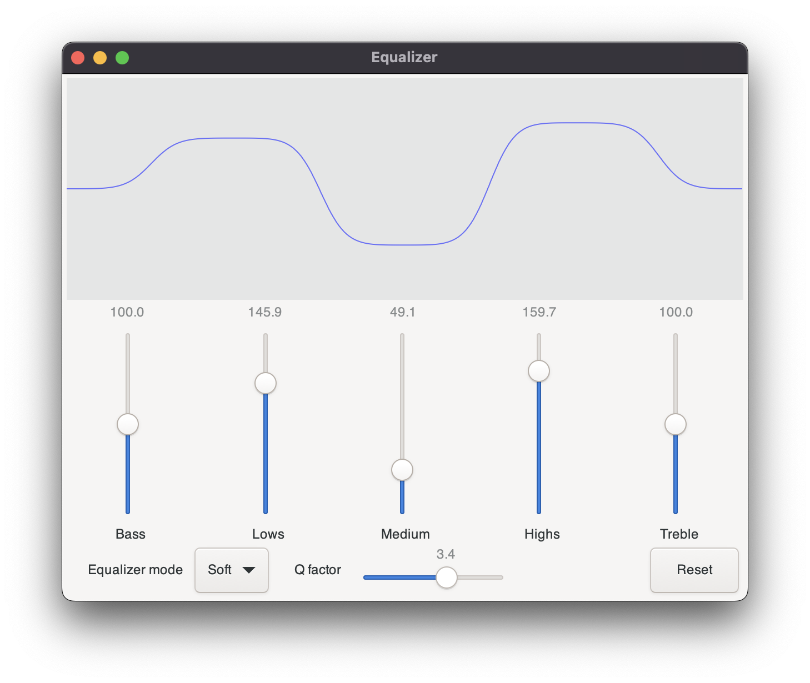

# SoundHook

>Sound processing project for Epita S4

-------

## Dependencies

### FTTW3

#### Install

```sh
% brew install fftw
```

### GTK3

#### Install

```sh
% brew install gtk+3
```

## Build and lauch the project

> Project is build with `CMake` you can build and launch the project with the CLion editor with a standard configuration or with command line.

### Build and run with command line

#### Build

```shell
% cmake -B build
% cd build
% make
```

#### Run the project

```shell
% ./mainUI #The graphic interface is launched
```

## The software

`SoundHook` allows you to apply sound processing tools such as Fourier or transform or Wavelet transform, on an audio track. On the main screen, you can visualize your soundtrack and choose what sound processing tool you want to apply. Once you press the apply button the software will apply the different sound processing you've selected. The sound previsualization update itself to the processed soundtrack. You can compare the old and new sounds by pressing the play buttons.



If you select the equalizer mode a new window opens. It allows you to use the built-in equalizer. In addition, there is a previsualization of the filter created by the equalizer so that you can get the perfect settings and understand the controls.

